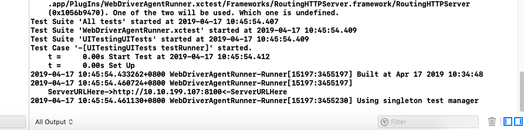
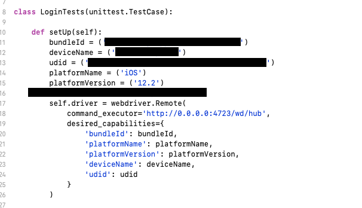
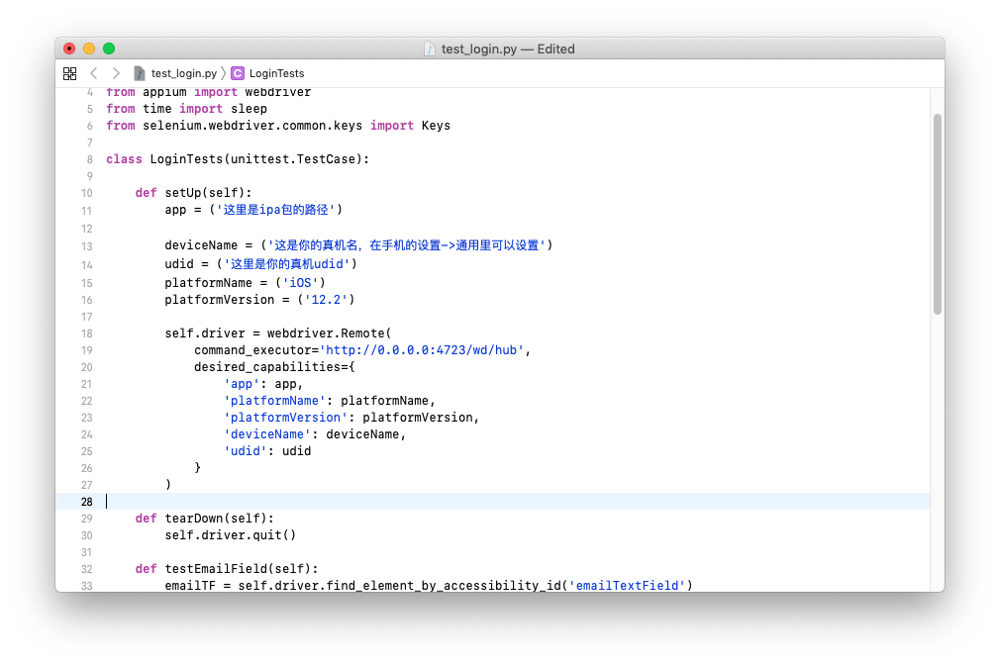

### **昨天的问题解决**
#### 1.npm的安装
完全卸载重新装了node后，发现npm install 命令还是不能用，但是看报错应该是网络原因，所以重新想换淘宝源，但是还是没用。所以继续Google找到一个解决方法。
https://stackoverflow.com/questions/42371380/npm-err-error-connect-econnrefused
可以尝试
```
npm config set proxy null
npm config set https-proxy null
npm config set registry http://registry.npmjs.org/
```
结果发现把源换成官方的反而可以install了。
但是这样还需要能一直连外网，而且速度还是很慢，于是再替换成淘宝源试试。
`npm config set registry http://registry.npm.taobao.org/`
换回官方源：
`npm config set registry https://registry.npmjs.org/`
结果这回install没问题了，所以决定把Appium等装好的全删了按照昨天的再走一遍。

#### 2.配置Appium环境
1. 安装Appium
 ` npm install -g appium`
2. 安装python 
 #注意：python应该是内置的，可以用brew更新到python3，具体都如上一篇中。
 ` brew isntall python`
3. Appium的插件安装
    1. 安装Appium-Python-Client
    `pip3 install Appium-Python-Client`
    #这一步也会自动安装selemium
    2. 安装pytest,一个为测试而生的框架，能格式化测试日志信息。
    `pip3 install -U pytest`
    3. Pytest 日志输出格式也有多种：xml、txt、和html，html需要安装插件支持
    `pip3 install pytest-html`
    4. 安装Carthage为了唤起WebDriveAgent
    `brew install carthage`
    5. 安装ios-deploy，Appium通过它把包安装到真机上。
    
    
 4. 在这些必要插件安装好后可以安装Appium-doctor来检查自己的appium环境是不是配置好了。
 `npm install appium-doctor -g`
 在appium-doctor成功安装后可以输入以下指令来检测iOS测试的环境。
 `appium-doctor --ios`  
 appium-doctor检测结果如下
 
 
 5. 接下来继续昨天的步骤，先试一下能不能模拟机运行。

4. Appium模拟运行
  打包、改python文件等具体过程略过。
  尝试直接用终端启动Appium
  `appium`
  启动成功,另起一个终端，运行pytest
  `pytest -v test_login.py --html=report/report.html`
  成功运行，接下来尝试真机测试
  
### 2. 真机测试
#### 1. 配置WebDriveAgent的证书。
进入WebDriveAgent文件夹，可以直接用下路径
`/usr/local/lib/node_modules/appium/node_modules/appium-xcuitest-driver/WebDriverAgent`
打开其中的叫WebDriverAgent.xcodeproj的xcode工程文件。修改target中的
WebDriverAgentLib和WebDriveAgentRunner的签名（最好每一个target都签名。），可以用个人签名，要改一下Identity里的Bundle Identifier，不能是默认的com.facebook.wda.lib。

还有WebdriverAgentRunner的签名，可能会签名失败，这个时候选到Build Settings里的packing选项卡的Product Bundle Indentifier，修改原来的com.facebook.wda.lib就可以了。修改完成后scheme选择WebDriveAgentRunner，输出选择自己的真机，然后运行test，可以直接cmd+U来运行test。（或者长按运行的按钮在下拉里有test选项，第一次运行真机需要在设置里授权。）

   这时候编译可能会报错，显示少了两个文件，退出xcode，用终端进入这个目录，运行以下指令来下载所需的依赖：
   `mkdir -p Resources/WdbDriverAgent.bundle`
   `./Scripts/bootstrap.sh -d`
   终端开始下载，如果没有问题等下载完打开xcode工程文件，就可以运行test了，
   成功test后xcode会在控制台输出如下
   
   这个时候去浏览器输入所提示的ServerURL，会打开一串JSON，如图。
   
   说明WebDriverAgent正常运行。
   

#### 2. 运行测试（示例AppiumTest工程,昨天的文章里有下载链接。）
1. 首先打开AppiumTest的Xcode工程文件，设置好证书、bundleId等事项，链接手机进行真机运行，在手机上确认能打开该app
2. 取得手机的udid,可以在Xcode里链接的设备里看到，或者用以下命令：
`ios-deploy -l`
 可以查看所有链接了这台mac的ios设备信息。
 
3. 在脚本内写好和测试真机相关的参数，如图：


一共5个参数，真机测试都是要填的，按实际情况填写好保存。

注意：不知道为什么用Appium向真机安装ipa包总是失败，所以在这里选择了先用Xcode在真机上运行一下demo来把demo安装到手机，如果是别的ipa包可以先用ios-deploy来安装，具体命令如下：
`ios-deploy -i 这里填要安装的真机udid -b 这里填要安装的ipa包的路径`
其他具体参数可以查看ios-deploy的帮助，运行命令后开始安装，安装会有进度显示，成功后即可在手机中看到可以运行的app。
如果要运行测试脚本的时候还真机内还没有安装好app，要用mac上的ipa包进行安装，则在写脚本的时候应该把`bundleId`参数换成`app`，对应的值也该设置为ipa包的路径，如图



4. 运行Appium
 还是两种运行方法，一种是直接在终端输入appium，由于今天的npm装好了，且通过npm安装了appium，所以这种启动方法成功了。
 第二种是通过Appium Desktop启动，和昨天一样。
 
   #注意：用Appium启动服务器之后，点击右上searh键可以弹出一个配置session的GUI，其实和脚本内的设置是一样的，点击左下的加号添加参数，具体的参数名和值和测试脚本里是一样的，一一对应填好之后，点击右下Start Session就会开始执行。注意，在start session前要确认最上面一栏选中了Automatic Server，否则会报错。
  此时运行后就会看到app的界面截图，点击截图或者旁边的列表就可以定位元素，还有一些别的功能如点击这个元素等，具体不介绍。
  ![https://github.com/delamita/Record/master/Appium%20iOS真机测试第二次总结.resources/appiumdesktopSession.png(Appium iOS真机测试第二次总结.resources/屏幕快照 2019-04-17 下午3.59.56.png)
  
   
 
 
5. 运行测试脚本
运行步骤和昨天一样，如果前面的配置没有问题，剩下的应该和模拟器是一样的步骤了。


后记：接下来准备将整个安装ipa，配置脚本、和运行脚本的过程都写成一个脚本达到一键运行的效果，然后尝试写一些能测试公司app的脚本。目前遇到的问题是看不到源码所以不知到怎么定位元素。
